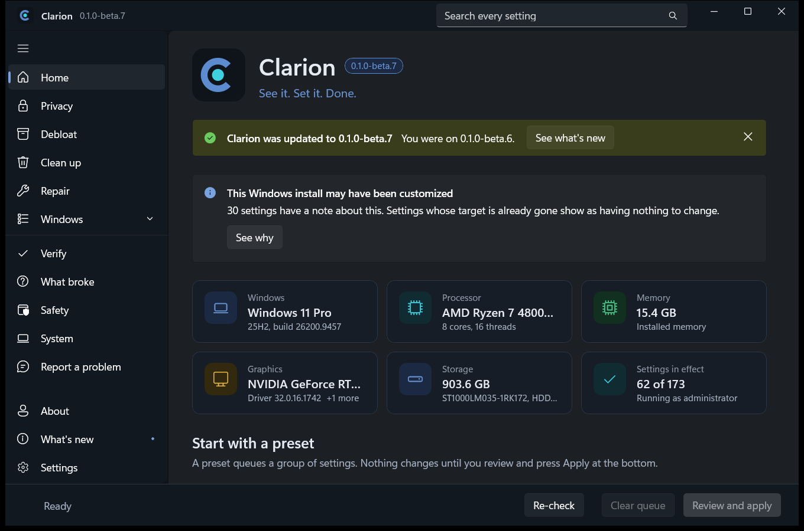
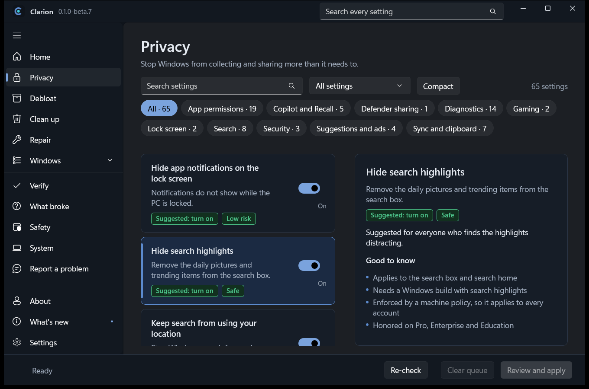
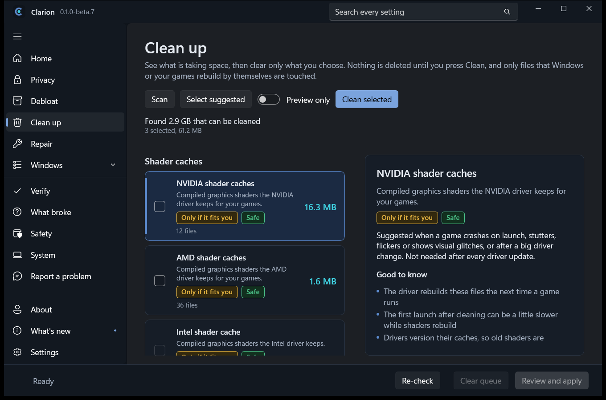
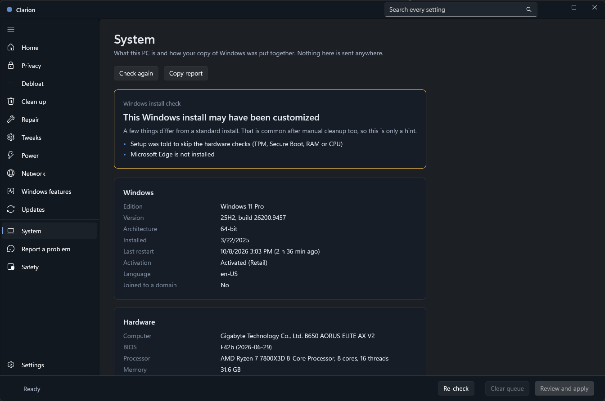

<div align="center">


# Clarion

**See it. Set it. Done.**

A native Windows app to remove bloat, cut tracking, clean up, repair and tune your PC.
Every change is explained, graded by evidence, backed up and reversible.

[](https://github.com/Kkthnx/Clarion/releases)
[](https://github.com/Kkthnx/Clarion/releases)


[**Download**](https://github.com/Kkthnx/Clarion/releases/latest) | [Report a problem](https://github.com/Kkthnx/Clarion/issues/new/choose) | [Changelog](CHANGELOG.md)

</div>

> **Beta.** Clarion is in public beta (0.1.0-beta.5). Expect rough edges and please report them. The version stays below 1.0 until the beta is ironed out and the downloads are code signed (see [docs/SIGNING.md](docs/SIGNING.md)).



## Why Clarion

- **Every setting explained.** Hover any setting for what it does, what you gain, what could go wrong and whether it is suggested. No research needed.
- **Evidence graded.** Each setting says how well it is backed, and privacy settings carry the Windows policy they come from, checked against the policy files on your PC.
- **Safe by design.** A restore point before every batch, a journal that records the real previous value, and one click revert.
- **Honest.** No telemetry in the app and no account. The only request Clarion can make is an update check, and that is off unless you ask for it. Weak or unproven tweaks are hidden unless you turn on Expert mode.



## What it does

| | |
|---|---|
| **Privacy and debloat** | About 175 settings across privacy, app removal, tweaks, power, network, Windows features and updates. |
| **Clean up** | Shader caches, launcher caches, browser and Windows leftovers. Scans first, shows exact folders and sizes, skips files in use and queues locked files for the next restart. |
| **Repair** | System file check, component repair, network and update resets. Output streams live and any job can be stopped. |
| **Presets** | Minimal, Standard, Advanced, Gaming and Privacy. Queue one, review it, apply it. |
| **DNS** | Pick a public provider from a dropdown, with optional encrypted lookups. Revert restores exactly what you had. |
| **System** | Windows edition, build, hardware and security state, plus a check for customized Windows images that explains every sign it finds. Settings that depend on something the image removed carry a note. |
| **Verify** | Checks everything Clarion applied against Windows now. Lists removed apps that came back and settings that were changed back, usually after a feature update. Put them back in one step, or leave them as they are. |
| **What's new** | What changed in each version, grouped as New, Safer, Fixed and Polish. When a newer version exists it lists everything you missed and links to the release page. Clarion never downloads or installs the update itself. |
| **Monthly check** | Optional. A scheduled task checks the settings Clarion applied on the second Wednesday of each month, the day after Windows' monthly updates, and tells you the next time you open Clarion what changed back. |
| **What broke** | Pick what stopped working and see which of your changes could explain it, newest first, with a revert button on each. |
| **Live progress** | A panel with a progress bar and one line per setting while changes apply. |
| **Report a problem** | Builds a bug report or suggestion with your system details and recent activity, with names, addresses and accounts removed. You can also add how your settings are holding up, which helps keep the "last checked" labels honest. You read it, then open it on GitHub yourself. |
| **Setup files and command line** | Save your choices to a file and apply them on another PC, or run everything from a terminal. |





## Install

1. Download `Clarion-<version>-setup.exe` from the [latest release](https://github.com/Kkthnx/Clarion/releases/latest). A portable zip is there too.
2. Run it. Clarion installs to Program Files with a Start menu entry and a clean uninstaller.
3. Open Clarion. It asks for administrator rights because most settings are machine wide.

The files are not code signed yet, so Windows SmartScreen may warn on first run. Signing is planned before 1.0. Each download has a SHA256 file next to it so you can verify it.

Requirements: Windows 10 version 2004 or later, 64-bit. Nothing else needs installing, because the .NET runtime is included.

## Command line

```
Clarion.exe --version
Clarion.exe --list-presets
Clarion.exe --apply-preset standard [--preview] [--no-restore-point]
Clarion.exe --apply setup.json [--preview] [--no-restore-point]
Clarion.exe --clean [--preview]
```

`--preview` shows what would change and changes nothing. Exit codes: 0 success, 1 some steps failed, 2 bad arguments or file, 3 not elevated.

## Build from source

Needs the .NET 9 SDK and the Windows 11 SDK.

```
dotnet test
dotnet build src/Clarion.App -p:Platform=x64
```

To build the installer and zip, install Inno Setup 6 and run `scripts/build-installer.ps1`.

## Docs

- [Design and approach](docs/DESIGN.md)
- [Feature matrix](docs/FEATURES.md)
- [Brand and palette](docs/BRAND.md)
- [Changelog](CHANGELOG.md)

## Principles

- Explain every change in plain language, with benefit and risk.
- Restore point before every batch, and a journal that restores the real prior value.
- Never weaken security.
- No telemetry in the app itself.

## License

All rights reserved for now.
